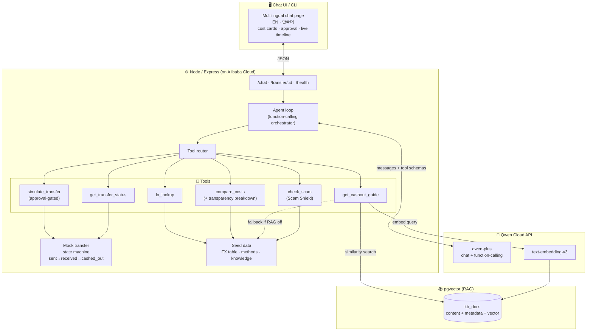

# RemitGuide — Architecture

RemitGuide is an **agentic, tool-using assistant** (not a scripted chatbot) that guides a
migrant worker through sending money home on the **Korea → Nigeria** corridor. The
intelligence runs on the **Qwen Cloud API** and the whole thing deploys to **Alibaba Cloud**.

> Demo only. All money movement is simulated; FX rates are illustrative seed values.

## System diagram

## The agent loop (core)

`src/agent.js` implements a real tool-calling loop:

1. Send the conversation + the 5 tool schemas to `qwen-plus` with `tool_choice: "auto"`.
2. If the model returns `tool_calls`, execute each via the tool router, append the
   results as `role: "tool"` messages, and loop again.
3. When the model returns plain content, that's the final answer — in the user's language.

The system prompt enforces the product's non-negotiables: mirror the user's language,
use low-jargon literacy-aware wording, always use tools for numbers (never guess), and
**never move money without explicit approval**.

## Human-in-the-loop (safety as a contract, not a UI hint)

Approval isn't just a button. `simulate_transfer` is **gated in the tool contract**: it
refuses to execute unless called with `approved: true`. Called without approval it returns
a `pending_approval` summary, which the UI renders as an Approve / Decline card. Only after
the user approves does the agent call the tool again with `approved: true`. The model
*cannot* move money on its own even if it tried.

## Tools

| Tool | Purpose | Backing |
|------|---------|---------|
| `fx_lookup` | Illustrative mid-market rate | Seed FX table |
| `compare_costs` | Rank methods by all-in cost (fee + FX), recommend cheapest | Seed methods |
| `simulate_transfer` | Start a simulated transfer (approval-gated) | In-memory store |
| `get_transfer_status` | "Where's my money?" → sent / received / cashed_out | Mock state machine (time-based) |
| `get_cashout_guide` | Recipient-side steps + scam warnings | pgvector RAG → seed fallback |
| `check_scam` | **Scam Shield** — judge a suspicious request, return risk + what to do | Pattern analysis + scam knowledge |

## Multilingual architecture (two-tier localization)

Language support is split into two cleanly separated tiers so it stays solid and honest:

1. **Conversation — unlimited.** Qwen `qwen-plus` is natively multilingual. The system prompt
   makes the agent detect the user's language and reply fully in it (any language, switching
   mid-chat). All user-facing *prose* — explanations, cash-out steps, scam warnings — is the
   agent's job to localize, even though tools return English reference data.
2. **UI chrome — curated + verified.** [`public/i18n.js`](../public/i18n.js) does Unicode-script +
   heuristic language detection, maps to a BCP-47 voice for read-aloud, flags RTL, and resolves
   ~30 UI labels from a hand-verified dictionary (13 languages) with **per-key English fallback**.
   `src/languages.js` is the canonical list, exposed at `GET /languages`.

This keeps the boundary clean: **tools = data, agent = localized prose, UI = localized chrome +
data-viz.** No half-translated strings ship; unknown languages still converse and voice correctly,
they just fall back to English chrome.

## Beyond the tools — the guidance layer

- **Read-aloud (accessibility):** the UI speaks any reply via the browser's SpeechSynthesis,
  auto-selecting Korean or English. For low-literacy / low-vision users — the brief's whole point.
- **Transparency receipt:** `compare_costs` returns a breakdown (mid-market value = fee + FX
  margin + what the family keeps) that the UI renders as a stacked bar. Fees become honest.
- **Hand-off for family:** the cash-out guide can be copied as a plain-language message to send
  the recipient — the last mile, made actionable.

## RAG

The knowledge base (Nigeria cash-out methods, scam patterns, corridor cost reference) is
embedded with **Qwen `text-embedding-v3`** into **pgvector** (`kb_docs`, HNSW cosine
index). `get_cashout_guide` embeds the user's need, retrieves the nearest method + scam
docs, and rebuilds a structured, grounded guide from their metadata. If pgvector or the
key is absent, it transparently falls back to the seed knowledge — same result shape.

## Deployment (target)

Single Node process on **Alibaba Cloud ECS** (or Function Compute), serving both the API
and the static UI. pgvector runs alongside (Docker / managed Postgres). The Qwen API is
called over the OpenAI-compatible endpoint. Proof-of-deployment is recorded for submission.

## Tech choices

- **Node / Express** — fastest path to the agent loop + static hosting in one process.
- **`openai` SDK against Qwen's OpenAI-compatible endpoint** — clean function-calling.
- **pgvector** — a real, production-shaped vector store; embeddings stay on Qwen.
- **Vanilla JS UI** — no build step, trivial to deploy and record.
